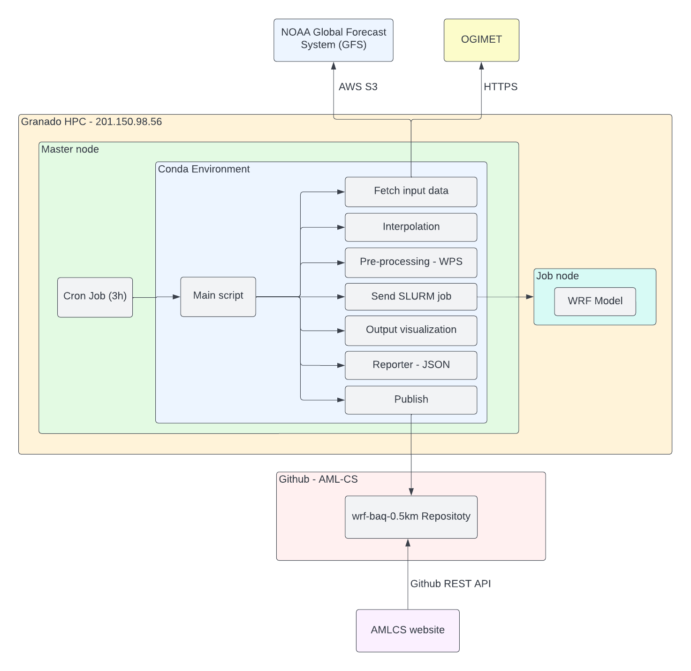

# WRF BAQ 0.5km Forecast
> A web weather forecasting system based on GFS - NOAA data interpolated with METAR reports running every 3h on the Granado HPC cluster.



## Data

- Granado folder location `/work/syseng/users/sjdonado/workspace/wrf-baq-0.5km`
- BAQ Geojson Polygon `/work/syseng/users/sjdonado/workspace/wrf-baq-0.5km/Limite Distrito de Barranquilla.geojson`
- Notebooks `/work/syseng/users/sjdonado/workspace/wrf-baq-0.5km/notebooks`
- Last WRF output `/work/syseng/users/sjdonado/workspace/wrf-baq-0.5km/output`
- Last NOAA - GFS data `/work/syseng/users/sjdonado/workspace/wrf-baq-0.5km/gfs-data`
- Last OGIMET data `/work/syseng/users/sjdonado/workspace/wrf-baq-0.5km/ogimet-data`
- Last GRIB data (interpolated files) `/work/syseng/users/sjdonado/workspace/wrf-baq-0.5km/grib-data`
- All Cron logs `/work/syseng/users/sjdonado/workspace/wrf-baq-0.5km/cron-logs`


## How to run

- Cronjob
```bash
0 */3 * * * /work/syseng/users/sjdonado/workspace/wrf-baq-0.5km/launch-cron.tcsh >> "/work/syseng/users/sjdonado/workspace/wrf-baq-0.5km/cron-logs/cron_$(date "+\%Y\%m\%d\%H\%M").log" 2>&1
```
- Manually
```bash
cd /work/syseng/users/sjdonado/workspace/wrf-baq-0.5km
./run.sh
```

## Docs

- [WRF + WRFDA Granado HPC](https://aml-cs.github.io/posts/wrf-wrfda-syseng-unhpc/)
- [Thesis report (Spanish)](https://docs.google.com/document/d/1ADC5PQXMw_4SefEPgx3IkGZfAmEkPHbyiehx4ZvuN44/edit?usp=sharing)
